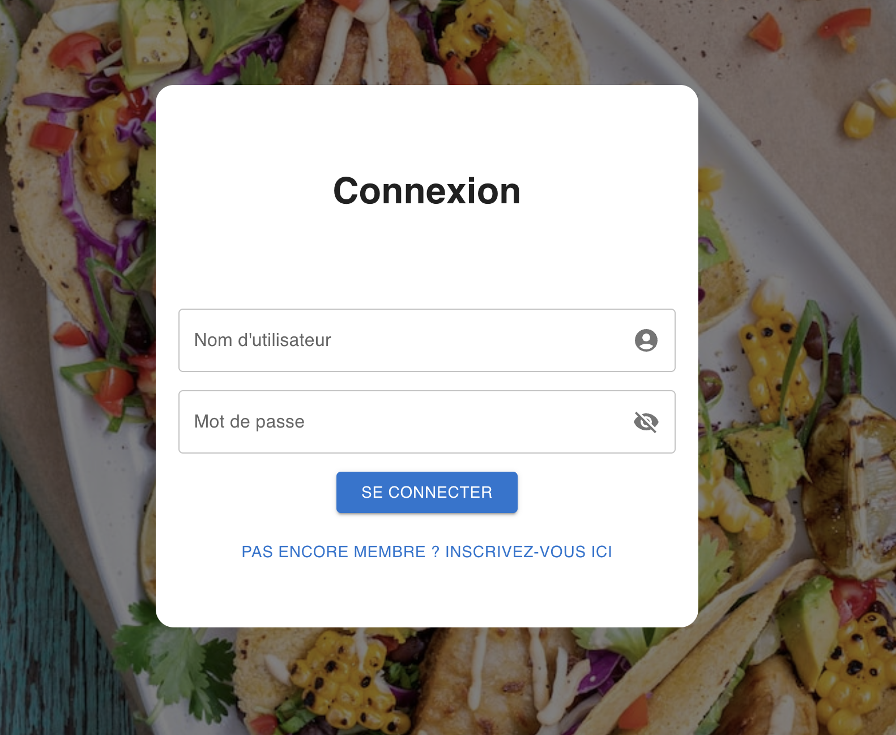
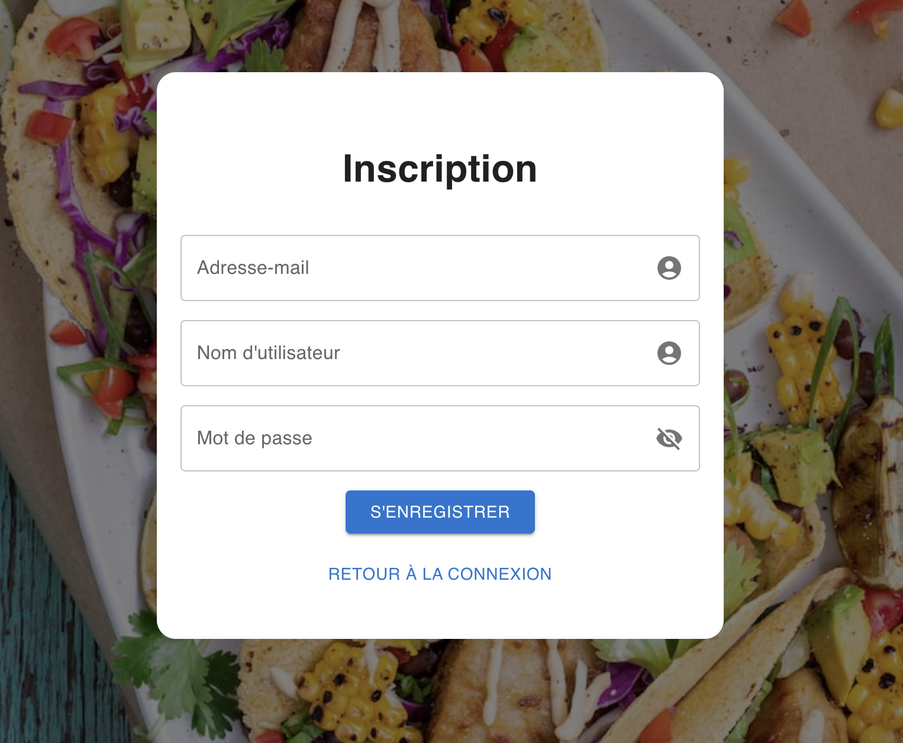

# React Component

## Installation

To start this project, make sure you have Node.js installed on your machine. Then, follow these steps:

Clone this repository to your machine.

Navigate to the project directory.

Install the dependencies using npm.

```
npm install
``````

## Getting Started

Once the dependencies are installed, you can launch the application using the following command:

```
npm start
```

The application will be accessible at [http://localhost:3000](http://localhost:3000) in your browser.

## Login Form

### Login Section


### Registration Section


path : [URL to view the Login Form](http://localhost:3000/login1)

# Contact
For any inquiries or assistance, please don't hesitate to contact us. You can reach us at the following email address:

Email: contact@innovatech-solution.fr

Language: We are proficient in both French and English.

Please feel free to contact us in either language that you are comfortable with.